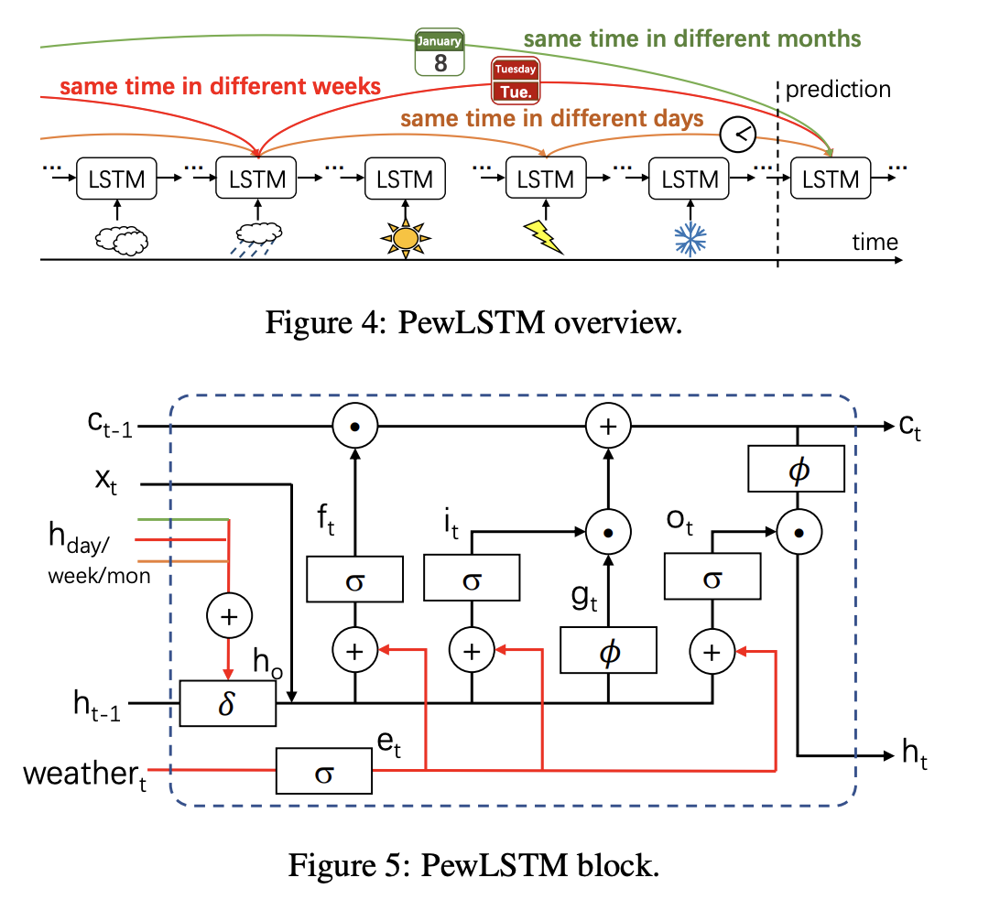
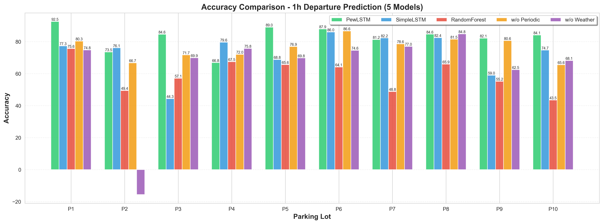
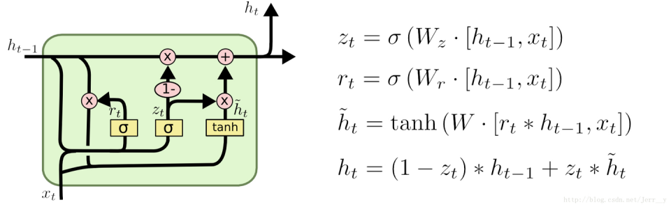
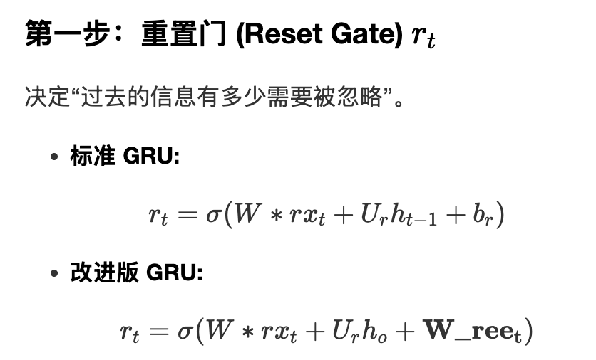
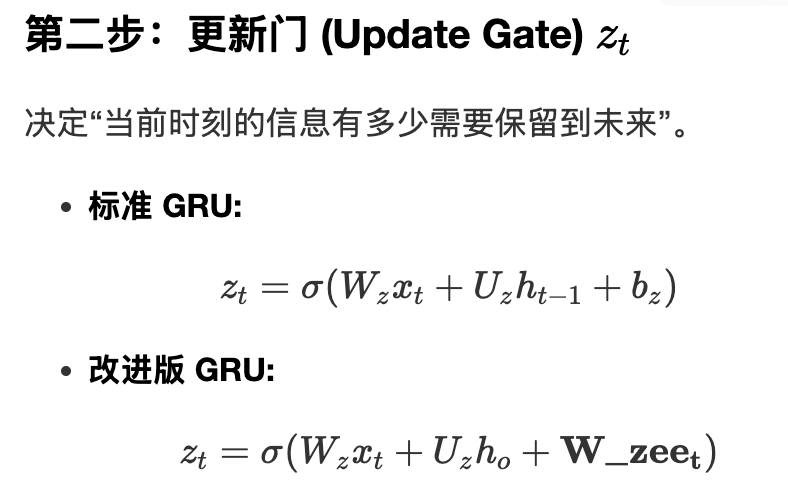
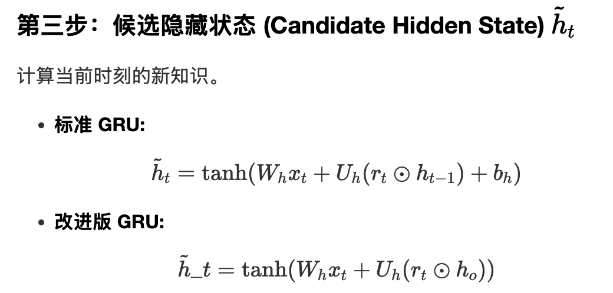
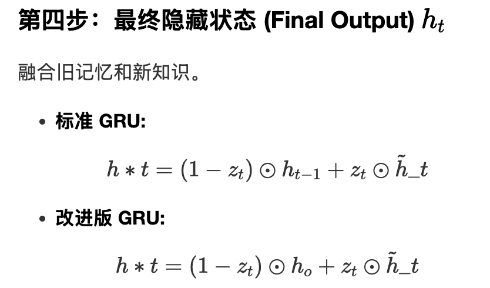
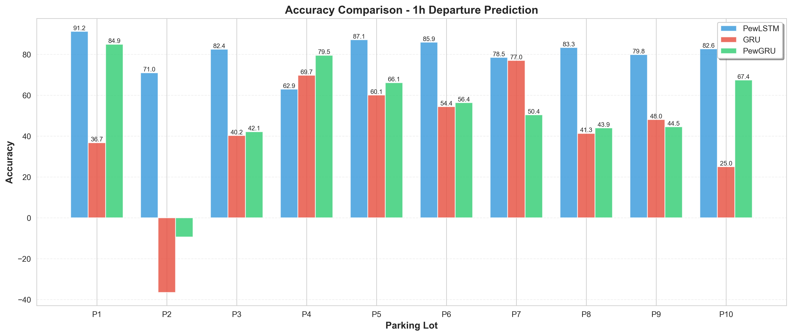

# 实验报告：基于 PewLSTM 的停车位预测复现与拓展

**[原论文：PewLSTM- Periodic LSTM with Weather-Aware Gating Mechanism for Parking Behavior Prediction](./src/paper/PewLSTM-%20Periodic%20LSTM%20with%20Weather-Aware%20Gating%20Mechanism%20for%20Parking%20Behavior%20Prediction.pdf)**

## 1. 简介
本报告总结了 PewLSTM 项目的实验结果。原论文利用改进的 LSTM 来预测停车位可用性（驶离/驶入车辆数）。核心贡献在于提出了 **PewLSTM (Periodic LSTM with Weather-Aware Gating)** ，将**周期性特征（日、周、月）和天气数据**直接融入到了门控机制中。

而我在论文研究中，复现了文中所提到的**五种算法机制的对比**，并创造性地用**GRU算法**和改进后**带有周期性和天气数据的PewGRU**进行了预测与比较，并得到对应的结论。

## 2. 原论文研究成果

### 2.1 LSTM 基础
LSTM（Long Short-Term Memory）是一种特殊的 RNN，其核心是“细胞状态”（Cell State），类似于一条携带信息的传送带。它通过三个“门”结构来控制信息的保留与遗忘，同时利用 Hidden State 作为短期记忆，侧重于即时输出。

*   **Input Gate（输入门）**：决定让哪些新信息加入（更新）。例如，读到“我的狗叫小满，它很可爱”，会判断“狗”和“小满”是重要的新信息，从而记下来。
*   **Forget Gate（遗忘门）**：决定扔掉哪些旧信息（过滤）。例如，当一个段落结束，新段落开始时，可能会决定丢弃有关前一个段落的人物信息，为新输入腾出空间。
*   **Output Gate（输出门）**：决定在当前时间点，取出哪些信息来用（输出）。例如，当需要回答“你的宠物叫什么名字？”时，会从 Cell State 上提取出“小满”这个信息作为答案，而暂时忽略“它很可爱”这个信息。

LSTM 的优势在于能处理长距离依赖序列，在 NLP、语音识别、时间序列预测等任务中效果显著，且比普通 RNN 更稳定，不易发生梯度消失。

### 2.2 问题定义
本研究将“停车行为”定义为预测未来某个小时内，一个停车场的**车辆到达数**和**车辆离开数**，而非简单预测“是否有可用空车位”。

由于以下关键变量在现实生活中对协助预测空车位有帮助，因此考虑融入论文中：
1.  **周期性 (Periodicity)**：停车行为具有很强的时间规律性。例如，今天上午 10 点的停车情况通常与昨天或上周同一时间高度相关。
2.  **停车位种类 (Type)**：不同地区的停车场空闲情况与时间差异相关。例如，商业区周末人多，而工业区工作日人多。
3.  **天气 (Weather)**：天气显著影响出行意愿。例如，雨天去商场的人可能增多，而室外景点的停车场可能更空闲。

### 2.3 PewLSTM 模型构建
为了解决上述问题，原论文设计了新的 LSTM 单元（PewLSTM Block），主要改进点如下：

1.  **周期性机制**：在每个时间步，模型不仅接收上一时刻的状态，还接收过去同一时刻（如 24 小时前、一周前、一个月前）的状态（分别表示为 $h_{day}$、 $h_{week}$ 和 $h_{mon}$），以便直接利用历史规律。设计了特殊的权重门 $\delta$ 将这些历史状态与 $h_{t-1}$ 相结合，用 $h_o$ 替换原 LSTM 中的 $h_{t-1}$。
2.  **天气门控机制**：天气数据（如温度、湿度、风速等）不再仅作为简单输入特征，而是通过专门的“门”处理后，生成天气向量 $e_t$，直接调控 LSTM 内部的三个核心门（$f_t$、$i_t$、$o_t$）。这使得模型能根据当前天气动态决定“忘记”多少历史信息或“记下”多少新信息。

最后搭建**模型架构**：
*   **Input Layer**：采用预处理后的数据。
*   **Deep PewLSTM Layer**：堆叠多个 PewLSTM 层以捕捉深层关系。
*   **Output Layer**：使用前馈神经网络进行最终的进出车辆数预测。
*   

## 3. 我的复现

### 3.1 对比模型
我复现了 PewLSTM，并进行了对比实验，评估了以下模型：

1.  **PewLSTM**：本项目提出的模型，融合了周期性门控和天气门控。
2.  **SimpleLSTM**：仅使用停车数量数据的标准双层 LSTM。
3.  **RandomForest**：作为基线的机器学习模型（随机森林回归器）。
4.  **两个消融实验模型**：
    *   **PewLSTM w/o Periodic**：禁用了周期性特征的 PewLSTM。
    *   **PewLSTM w/o Weather**：禁用了天气特征的 PewLSTM。

### 3.2 数据集与预处理
*   **地点**：10 个不同的停车场（P1 - P10）。
*   **特征**：历史停车数量、天气数据（温度、湿度等）以及周期性时间戳。
*   **预测时长**：未来 1 小时、2 小时和 3 小时。
*   **任务**：预测“驶离”（departure）和“驶入”（arrival）车辆数。

**具体的改进**：
1.  **数据集划分**：采用 75% 训练 / 25% 测试的比例。
2.  **非随机性训练**：按天为单位进行时间序列划分，保证每一天数据的完整性（24小时），且训练集进行随机性选取，消除时间序列的影响。
3.  **实现问题定义**：拆分预测到达数和离开数，分别进行建模。
4.  **输入输出**：输入包含历史停车数、天气、周期特征；输出为下一小时预计到达/离开的车辆数。
5.  **评价指标**：Accuracy 使用归一化值计算，RMSE 使用非归一化值计算。

### 3.3 评价指标
*   **Accuracy (准确率)**：自定义的准确率指标（越高越好）。
*   **RMSE (均方根误差)**：预测值与真实值的误差（越低越好）。

### 3.4 实验结果

**PewLSTM vs. 其他四种模型 (Epochs=100)**

*具体数据在中：`src/codes/LSTMCompare/results_v_full.csv` (1小时预测, 驶离任务)*

**主要发现：**
*   **PewLSTM 表现优异**：在绝大多数停车场中，PewLSTM 的准确率均显著高于 SimpleLSTM 和 RandomForest。
*   **消融性实验结果较差**：移除周期性特征 ("w/o Periodic") 或天气特征 ("w/o Weather") 通常会导致性能下降，证实了这两个组件的有效性。

## 4. 我的 GRU 拓展

我拓展额外实现了 GRU 预测和 PewGRU，并做了对比评估。

### 4.1 什么是 GRU
GRU（Gated Recurrent Unit）只有两个门：
*   **重置门 (Reset Gate, $r_t$)**：决定在计算候选状态时，历史信息参与多少。
*   **更新门 (Update Gate, $z_t$)**：决定“保留旧记忆”还是“写入新信息”。

### 4.2 GRU 特点
*   参数更少，训练和推理速度更快。
*   相比 LSTM，过拟合概率通常更低。

### 4.3 我的改进实现

**standard_GRU 类**：
*   标准 PyTorch GRU 单元实现。
*   参数：input_size, hidden_size。
*   不包含周期历史，不包含天气门控。

**pew_GRU 类**：
*   改进的 GRU，支持周期和天气特征。
*   **周期历史特征**：引入 $h_d$ (前1天), $h_w$ (前7天), $h_m$ (前30天)。
*   **天气门控与 $h_o$ 改进**：
    *   天气向量：$e_t = \sigma(W_e \cdot weather_t + b_e)$
    *   历史观察：$h_o = \sigma(W_d h_d + W_w h_w + W_m h_m + W_t h_t)$
    *   利用 $h_o$ 替换传统 GRU 中的 $h_{t-1}$，并利用 $e_t$ 调控重置门和更新门。

具体实现如图：

### 4.4 实验结果

**GRU Epochs=100**

**GRU Epochs=500**

*具体数据：`src/codes/GRUCompare/results_v1.csv` (1小时预测, 驶离任务，Epochs=100) `src/codes/GRUCompare/results_v2.csv` (1小时预测, 驶离任务，Epochs=500)*

**主要发现：**
*   **PewGRU 训练效率更高**：在 100 Epochs 时，PewGRU 在多个停车场（如 P1, P10）的准确率显著高于标准 GRU（例如 P1: 84.92% vs 36.74%）。这表明引入周期性和天气先验知识后，模型能更快地收敛并捕捉到有效特征。
*   **标准 GRU 的不稳定性**：标准 GRU 在训练早期（100 Epochs）表现极不稳定，甚至出现负值（如 P2），说明其在缺乏先验知识引导下难以快速拟合复杂的时间序列，但在 500 Epochs 后性能大幅提升。
*   **Pew 机制可能并不通用**：在高 Epochs 训练下，PewGRU 对比 GRU 的提升，并不能证明“周期性+天气门控”机制的有效性。GRU 由于门控少，可能会存在过拟合的情况。

## 5. 结论
实验结果表明，**PewLSTM** 模型在停车位可用性预测任务中非常有效，其融合的周期性和天气机制显著提升了预测性能，通过我实现了五种对比实验可以证明此结论。同时，我还拓展实现了 **GRU** 和 **PewGRU** 变体。在保持参数少、训练快优势的同时，PewGRU 在较少的 Epochs 训练情况下就能得到不错的结果。同时 **GRU** 算法在随着 Epochs 增大之后表现也变得不错。

## 6. 关于我的实现的补充

在实现过程中，我不仅实现了基于 `1h`、`departure`、`p1-p10` 的训练与预测，在 Python 代码中还可以训练与预测 `2h`、`3h`，同时也支持 `arrival` 的训练与预测，且十个停车场都支持。但由于训练时间需要很长，因此就不附上对应的结果。

在运行方面，`cd` 到对应的 `LSTMCompare` 或 `GRUCompare` 文件夹，运行 `python overall.py --mini --version v1 --epochs 100`，就可以进行 mini 版本的测试。mini 版本仅包含 `1h`、`departure`、`p1-p10` 的训练与预测。

同时可以通过设置 `--parks`、`--hours`、`--task` 进行定制化选择训练与预测。可以通过 `--version` 指定训练版本。我已经支持了 `checkpoints` 文件夹，可以随时恢复已经中断的训练成果（在指定 version 的情况下）。

在结果可视化上，只需要运行 `python visualize.py --csv results_v1.csv`，同时这里也支持指定 `--metrics` 参数来看更多可视化结果，可以用 `--output` 指定输出文件名，更多其他支持的参数和画的图请看对应文件夹下的 `usage.md`。